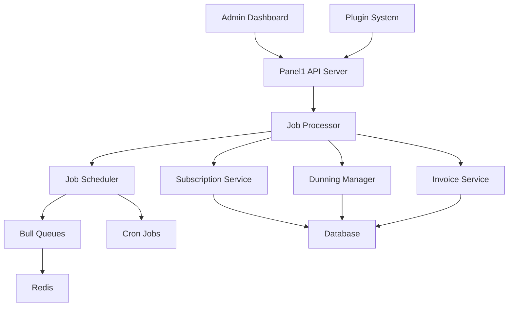

# 🔄 **Panel1 Subscription Automation System**

## 📋 **Overview**

The Panel1 Subscription Automation System provides comprehensive subscription lifecycle management with automatic invoice generation, renewal handling, cancellation/refund logic, and dunning management for failed payments.

## 🎯 **Key Features Implemented**

### ✅ **Core Automation Features**
- ✅ **Automatic invoice generation** for recurring subscriptions
- ✅ **Subscription renewal handling** with intelligent scheduling
- ✅ **Cancellation and refund logic** with proration support  
- ✅ **Dunning management** for failed payments with multiple strategies
- ✅ **Failed payment retry** with exponential backoff
- ✅ **Comprehensive audit trails** for all subscription changes
- ✅ **Multi-tenant support** with tenant isolation

### ✅ **Technical Infrastructure**
- ✅ **Job Scheduling System** using Bull queues and Redis
- ✅ **Cron-based automation** for daily/hourly processing
- ✅ **Event-driven architecture** with plugin hooks
- ✅ **Type-safe APIs** using tRPC and TypeScript
- ✅ **Database migrations** for all new tables
- ✅ **Graceful error handling** and retry mechanisms

---

## 🏗️ **Architecture Overview**

### **System Components**



### **Database Schema**

#### **New Tables Added**
1. **`scheduled_jobs`** - Tracks all background jobs
2. **`dunning_attempts`** - Manages failed payment recovery campaigns  
3. **`subscription_state_changes`** - Audit trail for subscription status changes

#### **Enhanced Tables**
1. **`subscriptions`** - Added fields for automation support:
   - `canceledAt`, `cancellationReason`
   - `trialStart`, `trialEnd`
   - `pastDueDate`, `suspendedAt`
   - `failedPaymentAttempts`, `lastPaymentAttempt`
   - `quantity`, `unitPrice`, `metadata`

2. **`payments`** - Added retry tracking:
   - `attemptCount` for payment retry logic

---

## 🔧 **Job System Architecture**

### **Queue Types**
- **`subscription-renewal`** - Handles subscription renewals
- **`invoice-generation`** - Automated invoice creation
- **`payment-retry`** - Failed payment retry attempts
- **`dunning-management`** - Dunning campaign execution

### **Cron Schedules**
- **Daily (1 AM UTC)**: Subscription renewal checks
- **Hourly**: Failed payment processing  
- **Every 6 hours**: Dunning campaign management
- **Every 30 minutes**: Process scheduled jobs

### **Job Processing Flow**
```typescript
1. Cron Job Triggers → 
2. Job Scheduler Creates Jobs → 
3. Bull Queue Processes → 
4. Service Layer Executes → 
5. Database Updates → 
6. Audit Logging
```

---

## 🎯 **Dunning Management**

### **Built-in Strategies**

#### **Default Strategy**
- Day 1: Email reminder
- Day 3: Email reminder  
- Day 7: Email reminder
- Day 14: Grace period (3 days)
- Day 17: Suspension
- Day 30: Cancellation

#### **Gentle Strategy**
- Day 2: Gentle reminder
- Day 7: Gentle reminder
- Day 14: Gentle reminder
- Day 21: Grace period (7 days)
- Day 28: Suspension
- Day 45: Cancellation

#### **Aggressive Strategy**
- Day 0: Immediate payment required
- Day 1: Urgent payment reminder
- Day 3: Urgent payment reminder
- Day 5: Grace period (2 days)
- Day 7: Suspension
- Day 14: Cancellation

### **Dunning Actions**
- **`email_reminder`** - Automated email notifications
- **`grace_period`** - Temporary payment extension
- **`suspension`** - Service suspension
- **`cancellation`** - Final subscription termination

---

## 💳 **Payment Processing & Retries**

### **Retry Logic**
- **Max Attempts**: 5 retries per payment
- **Backoff Strategy**: Exponential (1h, 2h, 4h, 8h, 16h)
- **Status Tracking**: Comprehensive attempt logging
- **Fallback Actions**: Automatic dunning after max retries

### **Payment States**
```typescript
PENDING → COMPLETED ✅
       → FAILED ❌ → RETRY → PAST_DUE → DUNNING
```

---

## 🧮 **Proration System**

### **Calculation Logic**
```typescript
// Example: Mid-cycle plan upgrade
const currentPlanDailyRate = currentPlanPrice / totalDaysInPeriod;
const newPlanDailyRate = newPlanPrice / totalDaysInPeriod;

const creditAmount = currentPlanDailyRate * remainingDays;
const chargeAmount = newPlanDailyRate * remainingDays;
const netAmount = chargeAmount - creditAmount;
```

### **Use Cases**
- Plan upgrades/downgrades mid-cycle
- Early subscription cancellations with refunds
- Service suspensions with credits

---

## 🚀 **Getting Started**

### **1. Install Dependencies**
```bash
cd apps/api
npm install
```

### **2. Run Database Migrations**
```bash
npm run db:migrate
```

### **3. Start Redis Server**
```bash
# Install Redis if not already installed
# Ubuntu/Debian: apt install redis-server
# macOS: brew install redis
redis-server
```

### **4. Start the API Server**
```bash
npm run dev
```

### **5. Test the System**
```bash
npm run test:subscription-automation
```

---

## 📡 **API Endpoints**

### **Subscription Management**
```typescript
// Get subscription details
GET /trpc/subscriptions.getById?input={"id":"uuid"}

// List subscriptions
GET /trpc/subscriptions.list?input={"status":"ACTIVE","limit":50}

// Cancel subscription
POST /trpc/subscriptions.cancel
Body: {
  "id": "uuid",
  "cancelAtPeriodEnd": false,
  "reason": "user_request",
  "refundUnusedTime": true
}

// Trigger manual renewal
POST /trpc/subscriptions.triggerRenewal
Body: {"id": "uuid"}

// Calculate proration
GET /trpc/subscriptions.calculateProration?input={"subscriptionId":"uuid","newPlanId":"uuid"}
```

### **Dunning Management**
```typescript
// Start dunning campaign
POST /trpc/subscriptions.startDunningCampaign
Body: {
  "subscriptionId": "uuid",
  "strategy": "default"
}

// Get dunning attempts
GET /trpc/subscriptions.getDunningAttempts?input={"subscriptionId":"uuid"}

// Get available strategies
GET /trpc/subscriptions.getDunningStrategies
```

### **System Administration**
```typescript
// Get job statistics
GET /trpc/subscriptions.getJobStats

// Trigger manual renewal check
POST /trpc/subscriptions.scheduleRenewalCheck

// Process failed payments
POST /trpc/subscriptions.processFailedPayments

// Process dunning campaigns  
POST /trpc/subscriptions.processDunningCampaigns
```

---

## 🔌 **Plugin Integration**

### **Available Hooks**
```typescript
// Subscription events
'subscription.renewal.due'
'subscription.renewed'
'subscription.payment.failed'
'subscription.cancelled'
'subscription.scheduled_for_cancellation'

// Dunning events
'dunning.campaign.started'
'dunning.attempt.completed'
'dunning.attempt.failed'
```

### **Example Plugin Usage**
```typescript
// Plugin hook for custom dunning logic
hooks: {
  'subscription.payment.failed': async ({ subscription, attemptNumber, context }) => {
    if (attemptNumber === 1) {
      // Send custom notification
      await sendCustomerNotification(subscription);
    }
  }
}
```

---

## 📊 **Monitoring & Analytics**

### **Job Queue Metrics**
- Active jobs per queue
- Completed job counts
- Failed job statistics
- Average processing times

### **Subscription Metrics**
- Renewal success rates
- Payment failure rates
- Dunning campaign effectiveness
- Churn analysis by cancellation reason

### **Available Dashboards**
```typescript
// Get subscription metrics
const metrics = await trpc.subscriptions.getMetrics.query();
// Returns: statusCounts, upcomingRenewals, failedPayments
```

---

## 🛠️ **Configuration**

### **Environment Variables**
```bash
# Redis Configuration
REDIS_HOST=localhost
REDIS_PORT=6379
REDIS_PASSWORD=optional

# Job Processing
MAX_JOB_ATTEMPTS=3
JOB_RETRY_DELAY=2000
QUEUE_CONCURRENCY=5

# Dunning Settings
DEFAULT_DUNNING_STRATEGY=default
GRACE_PERIOD_DAYS=3
MAX_DUNNING_ATTEMPTS=6
```

### **Tenant-Specific Settings**
Each tenant can configure:
- Dunning strategy preference
- Grace period duration
- Email templates
- Retry attempt limits

---

## ⚡ **Performance Optimizations**

### **Database Indexes**
- Optimized queries for subscription lookups
- Efficient filtering by status and dates
- Proper indexing on tenant_id for isolation

### **Queue Management**
- Background job processing
- Efficient retry mechanisms
- Dead letter queue handling
- Job cleanup and archival

---

## 🔒 **Security & Compliance**

### **Data Protection**
- Multi-tenant data isolation
- Audit trails for all changes
- Encrypted job payloads
- Secure webhook signatures

### **Access Control**
- Admin-only automation controls
- Tenant-scoped operations
- User permission checks
- API rate limiting

---

## 🧪 **Testing**

### **Run Full Test Suite**
```bash
npm run test:subscription-automation
```

### **Test Components Individually**
```bash
# Test job scheduling
npm run dev # Then trigger via API

# Test dunning strategies
curl -X POST /trpc/subscriptions.getDunningStrategies

# Monitor job queues
curl -X GET /trpc/subscriptions.getJobStats
```

---

## 📈 **Next Steps**

### **Phase 2 Enhancements**
- [ ] Advanced email templates
- [ ] SMS/webhook dunning channels  
- [ ] Machine learning churn prediction
- [ ] Advanced proration rules
- [ ] Custom dunning strategy builder

### **Integration Opportunities**
- [ ] Payment gateway webhooks
- [ ] External accounting systems
- [ ] Customer communication platforms
- [ ] Analytics and reporting tools

---

## 🤝 **Contributing**

The subscription automation system is designed for extensibility:

1. **Custom Dunning Strategies**: Add new strategies to `DunningManager`
2. **Job Processors**: Extend job types in `JobProcessor`
3. **Payment Integrations**: Enhance `PaymentService` integration
4. **Plugin Hooks**: Add new events to the system

---

## 📞 **Support**

For issues or questions about the subscription automation system:

- **GitHub Issues**: [Report bugs or request features](https://github.com/panel1-org/panel1/issues)
- **Documentation**: This guide and inline code comments
- **Test Script**: Run `npm run test:subscription-automation` for debugging

---

**The Panel1 Subscription Automation System is now ready for production use!** 🚀 